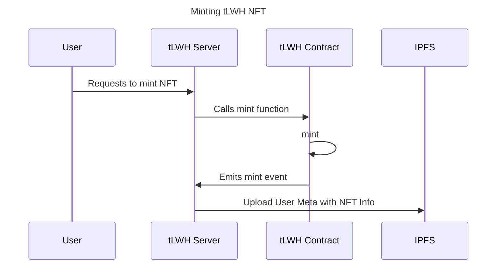
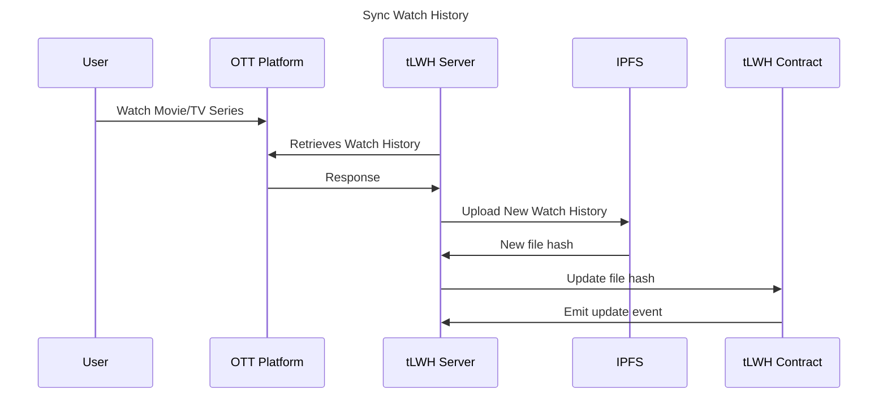

# the Last Watch Hist

## Overview

the Last Watch History (以下簡稱 tLWH) 的靈感來自最近熱門的 Social-Fi 類型應用、作者本身在 OTT 產業的相關經驗以及平時在觀影時的痛點。
tLWH 主要利用區塊鏈來紀錄使用者所有的觀影紀錄，並將這些觀影紀錄再提供給各大 OTT 平台，讓使用者在平台間切換時都可以獲得精準且高度個人化且的推薦內容。
未來 tLWH 也希望能提供使用者一個可以分享自己追劇心得、尋找同好的介面及管道。

## Framework

整個專案主要分為兩部份：

1. tLWH contract: 智能合約，使用 solidity 撰寫。負責依照不同的使用者身份 (User Identity) 產生 NFT Token 並對其 metadata 進行管理。
2. tLWH service: Web3 用戶端，使用 Ruby on Rails 撰寫。負責做為智能合約與使用者、IPFS、以及 OTT 平台之間的溝通橋樑。

### 專案進度

[Github Project](https://github.com/users/absoluteyl/projects/1)

### 流程圖

## Development

Include step-by-step instructions on how to set up and run the project.
.env.example
command example
If this project includes BE or FE, provide instructions for those as well.

## Testing

Explain how to run the tests.
[Nice to have] 80% or more coverage.

## Usage

Explain how to use the project and provide examples or code snippets to demonstrate its usage.
